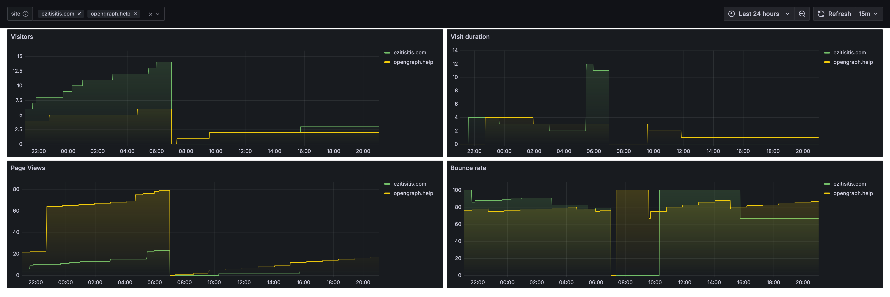

# Grafana Dashboard for Plausible Analytics exporter

[Grafana](https://grafana.com) Dashboard for [Plausible Analytics](https://www.plausible.io) with multiple sites
support.
It uses data provided by [Plausible exporter](https://github.com/riesinger/plausible-exporter).

## Usage

Import dashboard from `dashboards` directory, choose datasource and you are
ready to go.

## Credits

- Created by [Marks Bogdanovs](https://www.ezitisitis.com)
- Maintained by [Net service](https://www.netservice.lv)
